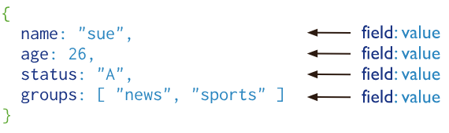

# Unlocking the Power of MongoDB: A Beginner's Guide

## What is MongoDB?

Imagine you have a giant digital notebook where you can jot down anything you like. Sometimes you write a list, other times you jot down a story or perhaps some random thoughts. This notebook is flexible and doesn't force you to organize your notes in a specific way. That's pretty much how MongoDB works.

MongoDB is a type of database known as NoSQL. Unlike traditional databases that store data in neat, structured tables (like spreadsheets), MongoDB stores data in a flexible, semi-structured way. This makes it incredibly versatile and easy to use, especially when dealing with large amounts of diverse data.

>SUMMARY
>- It is a NO SQL database as the data is not stored in the form of tables.
>- Data in MongoDB is stored in the form of [Document](#Document).
>- Being a NO SQL , it offers flexible different structures in the [Collection](#Collection)

## MongoDB VS MySQL
Usually choosing the type of db depends on the requirement of the application. But some benefits of Mongo DB over MySQL is:
 
### 1.Schema Flexibility:

    MongoDB: Being a NoSQL database, MongoDB offers a flexible schema design. 
    This means you can store documents with different structures in the same collection. 
    It is beneficial when dealing with unstructured or semi-structured data, or when the 
    schema might evolve over time.
    MySQL: As a relational database, MySQL enforces a fixed schema. Each row in a table
    must adhere to the predefined schema, which can be restrictive if your data model changes frequently.

### 2.Performance:

    MongoDB: Excels in read and write operations, especially with large volumes of data.
    Its document-oriented storage allows for faster retrieval of nested data structures
    without complex JOIN operations.
    MySQL: Performs well with structured data and complex queries involving multiple 
    tables and relationships. However, JOIN operations can become a bottleneck with very large
    datasets or highly relational data.


## Collection
MongoDB stores documents in collections. Collections are analogous to tables in relational databases.

## Document
A record in MongoDB is a document, which is a data structure composed of field and value pairs. MongoDB documents are similar to JSON objects. The values of fields may include other documents, arrays, and arrays of documents.


Documents are stored in a format called BSON (Binary JSON).

The value of a field can be any of the BSON data types, including other documents, arrays, and arrays of documents. For example, the following document contains values of varying types:
```javascript
var mydoc = {
  _id: ObjectId("5099803df3f4948bd2f98391"),
  name: { 
    first: "Alan", 
    last: "Turing" 
  },
  birth: new Date('Jun 23, 1912'),
  contribs: [ "Turing machine", "Turing test", "Turingery" ],
  views: NumberLong(1250000)
}
```

The above fields have the following data types:

* _id : holds an [ObjectId](#ObjectId).
* name : holds an embedded document that contains the fields first and last.
* birth : hold values of the Date type.
* contribs : holds an array of strings.
* views : holds a value of the NumberLong type.

### ObjectId
ObjectIds are small, likely unique, fast to generate, and ordered.

**_id** : _ObjectId_('6643416132f2740742398b74')

ObjectId values are **12 bytes** in length, consisting of:
1. A 4-byte timestamp, representing the ObjectId's creation, measured in seconds since the Unix epoch.
2. A 5-byte random value generated once per process. This random value is unique to the machine and process.
3. A 3-byte incrementing counter, initialized to a random value.

In MongoDB, each document stored in a collection requires a unique **_id** field that acts as a primary key. 
If an inserted document omits the _id field, the MongoDB driver automatically generates an ObjectId for the 
_id field.

when an document is fetched , _id is returned in this format.
```javascript
"id": 
{
  "timestamp": 66434161,
  "date": "2024-05-14T10:48:01.000+00:00"
}
```